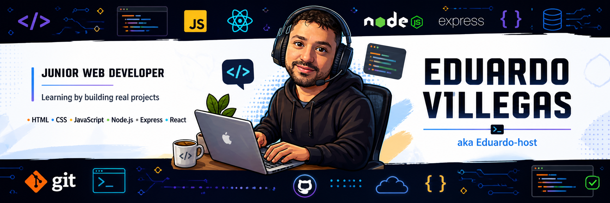

  

# Hey there! I'm Eduardo 👋

### Junior Web Developer in progress | JavaScript | Node.js | Express | EJS | Learning React

I'm currently learning full-stack web development and building real projects to improve my skills.  
I enjoy creating practical applications, working with APIs, and understanding how the frontend and backend communicate.

---

### 🚀 About Me

- 🌱 Currently learning JavaScript, Node.js, Express, EJS and React
- 🧠 Practicing backend fundamentals, REST APIs, CRUD operations and validations
- 🛠️ Building projects to improve my portfolio
- 🎯 Goal: become a professional web developer
- 💬 I like learning by building real examples and solving problems step by step

---

### 🛠️ Tech Stack

  
  
  
  
  
  
  
  

---

### 📚 Currently Practicing

- Building backend routes with Express
- Working with forms and validations
- Creating CRUD applications
- Connecting frontend views with backend logic
- Using Git and GitHub for version control
- Learning how REST APIs work

---

---

### 📌 Featured Projects

#### 🎮 JavaScript Browser Game

A browser-based game built with HTML, CSS and JavaScript.  
This project helped me practice DOM manipulation, event listeners, game logic, sound effects and deployment with GitHub Pages.

**What I practiced:**

- JavaScript DOM manipulation
- Event handling
- Audio handling in the browser
- Game state and score tracking
- Git, GitHub and GitHub Pages deployment

**Tech Used:** HTML, CSS, JavaScript

🔗 **Live Demo:** Add your GitHub Pages link here  
📂 **Repository:** Add your repository link here

---

#### 🧾 Express Form Validation App

A backend project built with Node.js, Express and EJS.  
The app handles form submissions, validates user input and renders different views depending on the result.

**What I practiced:**

- Express routes
- Server-side form validation
- `req.body` handling
- EJS views
- Error messages under form inputs
- Success page rendering
- Basic MVC-style organization

**Tech Used:** Node.js, Express, EJS, JavaScript

📂 **Repository:** Add your repository link here

---

#### 🍹 Restaurant Menu & Recipe App

A restaurant-focused app idea designed to help search food and drink items, view descriptions and display recipe details.  
This project connects with my real work experience in a restaurant and helps me build something practical from a real-life problem.

**What I want to build/practice:**

- Login screen
- Search menu
- Food and drink cards
- Item descriptions
- Recipe details
- Clean visual interface
- Future backend connection

**Tech Planned:** HTML, CSS, JavaScript, React, Node.js, Express

📂 **Repository:** Coming soon

---

---

### 🤝 Let's Connect

I'm currently building projects, improving my full-stack skills and growing as a web developer.

  

